# 📘 BUKU PANDUAN PENGGUNAAN SISTEM (MANUAL BOOK)
## **SILAKAN — Sistem Informasi Layanan Kantor**
### **Kantor Perwakilan Bank Indonesia Provinsi Sulawesi Utara**

---

**Nama Dokumen** : Buku Panduan Penggunaan Sistem (Manual Book) &mdash; SILAKAN  
**Versi Dokumen** : 1.0 (Final)  
**Tanggal Rilis** : September 2026  
**Instansi Pemilik** : Kantor Perwakilan Bank Indonesia Provinsi Sulawesi Utara  
**Pengelola Sistem** : Unit Rumah Tangga & Logistik / Sekretariat Pimpinan (Sarpras)  
**Format Cetak Resmi** : `Manual_Book_SILAKAN_v1.0.pdf` (A4 Portrait)

---

## 📑 **DAFTAR ISI**

1. [BAB I: PENDAHULUAN](#bab-i-pendahuluan)
   - 1.1 Latar Belakang Digitalisasi Layanan Kantor
   - 1.2 Tujuan Penerapan SILAKAN
   - 1.3 Manfaat bagi Pegawai Unit & Manajemen
   - 1.4 Ruang Lingkup Sistem & Modul Utama
   - 1.5 Sasaran Pengguna
2. [BAB II: GAMBARAN UMUM SISTEM & ARSITEKTUR](#bab-ii-gambaran-umum-sistem--arsitektur)
   - 2.1 Deskripsi Fungsional Sistem
   - 2.2 Arsitektur Sistem Berbasis MVC Laravel 12
   - 2.3 Matriks Role dan Hak Akses Pengguna
   - 2.4 Struktur Menu Navigasi (Sitemap)
3. [BAB III: PERSIAPAN PENGGUNA & LINGKUNGAN KERJA](#bab-iii-persiapan-pengguna--lingkungan-kerja)
   - 3.1 Kebutuhan Perangkat Keras & Monitor
   - 3.2 Peramban (Browser) yang Direkomendasikan
   - 3.3 Koneksi Jaringan & Intranet Bank Indonesia
   - 3.4 Kredensial Akun & Alamat URL Akses
4. [BAB IV: AUTENTIKASI DAN PENGELOLAAN AKUN](#bab-iv-autentikasi-dan-pengelolaan-akun)
   - 4.1 Membuka Halaman Login
   - 4.2 Prosedur Masuk Sistem (Login)
   - 4.3 Prosedur Keluar Sistem (Logout Aman)
   - 4.4 Pengelolaan Profil Pengguna & Nomor WhatsApp
   - 4.5 Penggantian Password Akun Unit Kerja
5. [BAB V: PANDUAN PENGGUNA (USER / PEGAWAI UNIT KERJA)](#bab-v-panduan-pengguna-user--pegawai-unit-kerja)
   - 5.1 Memahami Antarmuka Dashboard User
   - 5.2 Tata Cara Mengajukan Pemesanan Ruangan Rapat (Langkah Demi Langkah)
   - 5.3 Pemilihan Ruangan & Smart Layout Filtering Dinamis
   - 5.4 Validasi Bentrok Jadwal Otomatis (WITA) & Kalender Hari Libur
   - 5.5 Pengungahan Lembar Disposisi / Nota Dinas (PDF/JPG/PNG Maks. 5MB)
   - 5.6 Memantau Status & Riwayat Pemesanan (Arti Label Indikator Badge)
   - 5.7 Memeriksa Rincian Detail Pemesanan
   - 5.8 Tata Cara Pembatalan Pemesanan Ruangan
   - 5.9 Menggunakan Fitur "Selesai Lebih Awal" (Early Release)
   - 5.10 Pemanfaatan Kalender Ruangan Interaktif
   - 5.11 Pengelolaan Notifikasi In-App & Fitur Pembersihan Pesan
6. [BAB VI: PANDUAN ADMINISTRATOR (ADMIN SARPRAS / SEKPR)](#bab-vi-panduan-administrator-admin-sarpras--sekpr)
   - 6.1 Dashboard Analytics Administrator & Diagram Eksekutif
   - 6.2 Alur Verifikasi & Persetujuan (Approval) Pemesanan Ruangan
   - 6.3 Alur Penolakan (Rejection) Pemesanan Disertai Catatan Alasan
   - 6.4 Pemantauan Live Monitoring & Countdown Timer Real-Time
   - 6.5 Pengelolaan Master Data Ruangan & Pivot Layout Rounded Badge
   - 6.6 Pengelolaan Master Data Layout Ruangan
   - 6.7 Pengelolaan Master Hari Libur & Sinkronisasi API Nasional
   - 6.8 Manajemen Akun Pengguna & Proteksi Keamanan Self-Delete
   - 6.9 Rekapitulasi Laporan Pemakaian Ruangan, Ekspor Excel & Cetak PDF KOP BI
   - 6.10 Pemantauan Rekam Jejak Terpusat (Audit Log System)
7. [BAB VII: PANDUAN TAMPILAN TV MONITOR LOBBY (KIOSK MODE)](#bab-vii-panduan-tampilan-tv-monitor-lobby-kiosk-mode)
   - 7.1 Mengakses Mode Layar TV Lobby (`/display`)
   - 7.2 Pembaruan Otomatis Latar Belakang (Auto Refresh JSON 30 Detik)
8. [BAB VIII: PANDUAN TROUBLESHOOTING & PENANGANAN KENDALA](#bab-viii-panduan-troubleshooting--penanganan-kendala)
9. [BAB IX: FREQUENTLY ASKED QUESTIONS (FAQ)](#bab-ix-frequently-asked-questions-faq)
10. [BAB X: GLOSARIUM & PENUTUP](#bab-x-glosarium--penutup)

---

## 📌 **BAB I: PENDAHULUAN**

### **1.1 Latar Belakang Digitalisasi Layanan Kantor**
Sistem Informasi Layanan Kantor (**SILAKAN**) dikembangkan khusus untuk mengotomatisasi, memodernisasi, dan mentransparansikan seluruh alur permohonan dan pengelolaan ruang rapat di lingkungan **Kantor Perwakilan Bank Indonesia Provinsi Sulawesi Utara (KPwBI Prov. Sulut)**.

Sebelum diterapkannya SILAKAN, proses pemesanan ruangan dilakukan secara manual melalui koordinasi lisan atau nota dinas fisik yang rentan menimbulkan tumpang tindih (*double booking*) jadwal rapat, keterlambatan informasi persetujuan, dan ketidakpastian ketersediaan ruangan bagi unit kerja lainnya.

### **1.2 Tujuan Penerapan SILAKAN**
1. **Otomasi Deteksi Bentrok**: Menghilangkan jadwal ganda secara mutlak melalui validasi waktu nyata berstandar zona Waktu Indonesia Tengah (WITA).
2. **Smart Layout Selection**: Menghubungkan secara dinamis pilihan tata letak meja-kursi hanya sesuai peruntukan fisik ruangan yang dipilih.
3. **Notifikasi Instan Multi-Saluran**: Memberikan kepastian status pemesanan secara langsung melalui pesan otomatis WhatsApp Gateway dan lonceng web notification.
4. **Pemantauan Waktu Nyata**: Menyediakan countdown timer ruangan aktif dan layar informasi TV Monitor Lobby kantor.
5. **Tertib Administrasi**: Mengarsipkan riwayat pemakaian, berkas disposisi digital, dan rekam jejak aktivitas audit log terpusat.

### **1.3 Manfaat bagi Pegawai Unit & Manajemen**
- **Bagi Pegawai Unit Kerja**: Mengajukan ruangan secara mandiri kapan saja, melihat kalender rapat interaktif, membatalkan acara secara praktis, dan dapat mengosongkan ruangan lebih awal jika acara selesai lebih cepat.
- **Bagi Administrator Sarpras**: Meninjau kelayakan berkas secara digital, menyetujui/menolak pengajuan dalam hitungan detik, serta mengunduh laporan rekapitulasi Excel dan PDF ber-KOP Bank Indonesia.

### **1.4 Ruang Lingkup Sistem & Modul Utama**
Sistem SILAKAN versi 1.0 mencakup 8 modul fungsional:
1. Modul Autentikasi & Hak Akses Berbasis Peran (RBAC)
2. Modul Pemesanan Ruangan & Validasi Konflik WITA
3. Modul Verifikasi & Approval Permohonan
4. Modul Live Monitoring & Countdown Timer
5. Modul Kalender Ruangan Terintegrasi Hari Libur
6. Modul Notifikasi Multi-Saluran (In-App & WhatsApp Gateway)
7. Modul Master Data (Ruangan, Layout, Hari Libur, User)
8. Modul TV Kiosk Display & Pelaporan Eksekutif

> **Catatan Arsitektur:** Pada versi 1.0, modul fasilitas mandiri telah disederhanakan dan disatukan ke dalam catatan perlengkapan pemesanan untuk mempercepat proses pengisian formulir.

### **1.5 Sasaran Pengguna**
- Seluruh pegawai unit kerja internal KPwBI Prov. Sulut (Kehumasan, Keuangan, SDM, SP, PUR, FDSEK, FPKP, FPPU, PIPEBI, PPBI).
- Administrator Sarana & Prasarana / Rumah Tangga / Sekretariat Pimpinan.
- Teknisi IT & Helpdesk pendukung operasional kantor.

---

## 📌 **BAB II: GAMBARAN UMUM SISTEM & ARSITEKTUR**

### **2.1 Deskripsi Fungsional Sistem**
SILAKAN adalah aplikasi berbasis web yang responsif dan berjalan pada jaringan intranet internal Bank Indonesia. Antarmuka sistem mematuhi panduan identitas visual korporat Bank Indonesia dengan palet warna biru primer (`#005baa`), navy (`#003b73`), dan aksen emas (`#b8972a`).

### **2.2 Arsitektur Sistem Berbasis MVC Laravel 12**
Sistem dibangun menggunakan framework **Laravel 12**, bahasa pemrograman **PHP 8.4**, antarmuka **Blade Engine**, dan database **MySQL**. Alur kerja sistem memisahkan lapisan tampilan, routing middleware, aksi logika bisnis (*Action Layer*), dan model data Eloquent ORM.

### **2.3 Matriks Role dan Hak Akses Pengguna**

| Role Pengguna | Deskripsi & Subjek | Hak Akses Fitur Utama | Batasan Akses |
| :--- | :--- | :--- | :--- |
| **User (Unit Kerja)** | Staf perwakilan unit kerja KPwBI Prov. Sulut. | Input pemesanan baru, memantau riwayat pengajuan, membatalkan pemesanan, menyelesaikan rapat lebih awal, kalender ruangan, notifikasi, edit profil. | Tidak memiliki akses ke menu approval, master data, audit log, dan laporan manajerial. |
| **Administrator** | Staf pengelola Sarpras / Rumah Tangga / Sekpr. | Dashboard analitik statistik, approve/reject permohonan, live monitoring countdown, kelola master ruangan & layout, kelola hari libur & sync API, manajemen user, laporan Excel & PDF, audit log. | Dilarang menghapus akunnya sendiri yang sedang aktif login (Self-Delete Protection). |
| **Kiosk Display** | Layar Smart TV Monitor Lobby Kantor. | Menampilkan jadwal rapat hari ini, status ruangan aktif, jam digital WITA, dan auto-refresh latar belakang setiap 30 detik. | Mode publik tanpa login; hanya menampilkan data tanpa kemampuan edit. |

### **2.4 Struktur Menu Navigasi (Sitemap)**
- **Struktur Menu User**: Dashboard &rarr; Pemesanan &rarr; Kalender Ruangan &rarr; Riwayat Pemesanan &rarr; Notifikasi &rarr; Profil Saya.
- **Struktur Menu Administrator**:
  - **UTAMA**: Dashboard &rarr; Pemesanan Ruangan (Approval) &rarr; Kegiatan Berlangsung &rarr; Kalender Ruangan &rarr; Notifikasi.
  - **MASTER DATA**: Data Ruangan &rarr; Data Layout &rarr; Hari Libur &rarr; Data User.
  - **SISTEM**: Laporan &rarr; Audit Log.

---

## 📌 **BAB III: PERSIAPAN PENGGUNA & LINGKUNGAN KERJA**

### **3.1 Kebutuhan Perangkat Keras & Monitor**
- **Komputer Desktop / Laptop**: RAM minimal 2 GB (Disarankan 4 GB+), resolusi layar minimal 1366 &times; 768 (Disarankan Full HD 1920 &times; 1080).
- **Perangkat Mobile**: Smartphone / Tablet berbasis Android atau iOS dengan peramban modern.
- **Smart TV Lobby**: Layar monitor Full HD atau 4K dengan koneksi kabel LAN atau WiFi intranet kantor.

### **3.2 Peramban (Browser) yang Direkomendasikan**
- **Google Chrome** (Versi 100+) &mdash; *Sangat Direkomendasikan*
- **Microsoft Edge** (Versi 100+) &mdash; *Sangat Direkomendasikan*
- **Mozilla Firefox** (Versi 100+)
- **Safari** (Versi 15+ untuk macOS/iOS)

### **3.3 Koneksi Jaringan & Intranet Bank Indonesia**
Perangkat kerja wajib terhubung ke jaringan kabel LAN kantor atau WiFi resmi internal Bank Indonesia (misal: *BI-Corporate*). Jika bekerja dari luar kantor, aktifkan VPN internal Bank Indonesia terlebih dahulu.

### **3.4 Kredensial Akun & Alamat URL Akses**
- **Alamat URL Aplikasi**: `http://localhost:8000` (atau IP Server Lokal Bank Indonesia).
- **Alamat URL Kiosk TV Lobby**: `http://localhost:8000/display` (atau `http://localhost:8000/kiosk`).
- **Username Default Unit**: Terdaftar sesuai unit kerja (contoh: `uk_kpwbisulut`, `sp_kpwbisulut`, `pur_kpwbisulut`, `admin`).
- **Password Default Awal**: Diberikan oleh Administrator Sarpras dan wajib segera diganti setelah login pertama.

---

## 📌 **BAB IV: AUTENTIKASI DAN PENGELOLAAN AKUN**

### **4.1 Membuka Halaman Login**
Buka browser dan arahkan ke alamat URL SILAKAN. Sistem akan menampilkan formulir masuk ber-KOP resmi Bank Indonesia KPwBI Prov. Sulut.

*Gambar 4.1 &mdash; Halaman Form Login Masuk Sistem SILAKAN*

### **4.2 Prosedur Masuk Sistem (Login)**
1. Masukkan **Username** atau **Email** unit kerja pada kolom `Username / Email`.
2. Masukkan **Password** akun Anda pada kolom `Password`. Gunakan ikon mata (<i class="bi bi-eye"></i>) untuk memeriksa ketikan sandi.
3. Centang *Ingat saya di perangkat ini* jika menggunakan PC kantor pribadi.
4. Klik tombol biru **Masuk**. Sistem akan memvalidasi data dan mengarahkan ke dashboard utama.

### **4.3 Prosedur Keluar Sistem (Logout Aman)**
1. Buka menu sidebar sebelah kiri dan gulir ke bagian bawah.
2. Klik tombol merah **Keluar** di samping info akun Anda.
3. Sesi peramban dihapus secara aman dan Anda diarahkan kembali ke halaman login.

### **4.4 Pengelolaan Profil Pengguna & Nomor WhatsApp**
1. Klik menu **Profil** pada sidebar atau nama profil Anda di kanan atas.
2. Perbarui **Alamat Email** dan **Nomor WhatsApp** penanggung jawab unit (format: `081234567890`).
3. Klik tombol **Simpan Perubahan**.

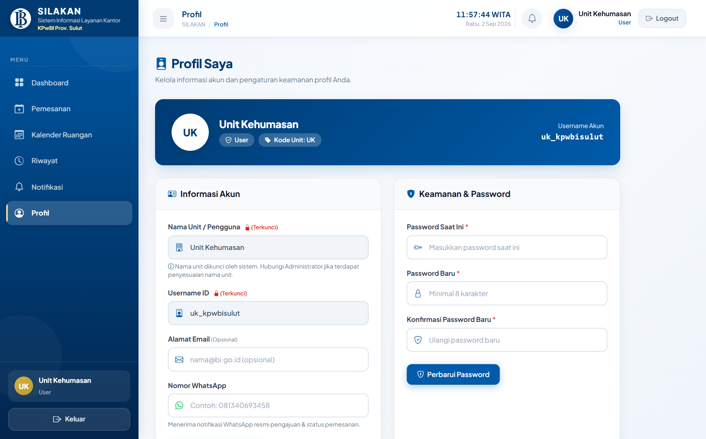
*Gambar 4.2 &mdash; Halaman Pengaturan Profil Saya & Keamanan Password*

### **4.5 Penggantian Password Akun Unit Kerja**
Pada halaman Profil, gulir ke kartu **Ubah Kata Sandi**:
1. Masukkan *Kata Sandi Saat Ini*.
2. Masukkan *Kata Sandi Baru* (minimal 8 karakter kombinasi).
3. Masukkan ulang pada *Konfirmasi Kata Sandi Baru*.
4. Klik tombol **Perbarui Password**.

---

## 📌 **BAB V: PANDUAN PENGGUNA (USER / PEGAWAI UNIT KERJA)**

### **5.1 Memahami Antarmuka Dashboard User**
Dashboard User menampilkan ringkasan kartu statistik pemesanan unit, daftar rapat yang sedang berlangsung hari ini, agenda rapat mendatang, dan permohonan terkini.

*Gambar 5.1 &mdash; Tampilan Dashboard Pengguna (Unit Kerja)*

### **5.2 Tata Cara Mengajukan Pemesanan Ruangan Rapat**
1. Klik menu **Pemesanan** pada panel navigasi kiri.
2. Lengkapi seluruh kolom formulir peminjaman ruangan.

*Gambar 5.2 &mdash; Formulir Pembuatan Pemesanan Ruangan Baru*

### **5.3 Pemilihan Ruangan & Smart Layout Filtering Dinamis**
SILAKAN menyaring pilihan layout secara otomatis sesuai peruntukan fisik ruangan yang dipilih:
- **Ruangan Fleksibel (contoh: Balai Kerapuan / Tondano, Tomohon, Lokon)**: Menampilkan dropdown layout seperti *U-Shape, Classroom, Teater, Round Table*.
- **Ruangan Konfigurasi Tetap (contoh: Ruangan Bunaken, Linow, Mahawu)**: Dropdown secara otomatis menampilkan keterangan: `-- Tidak ada layout khusus untuk ruangan ini --`.

| Dropdown Layout: Tondano | Dropdown Layout: Bunaken |
| :---: | :---: |
| 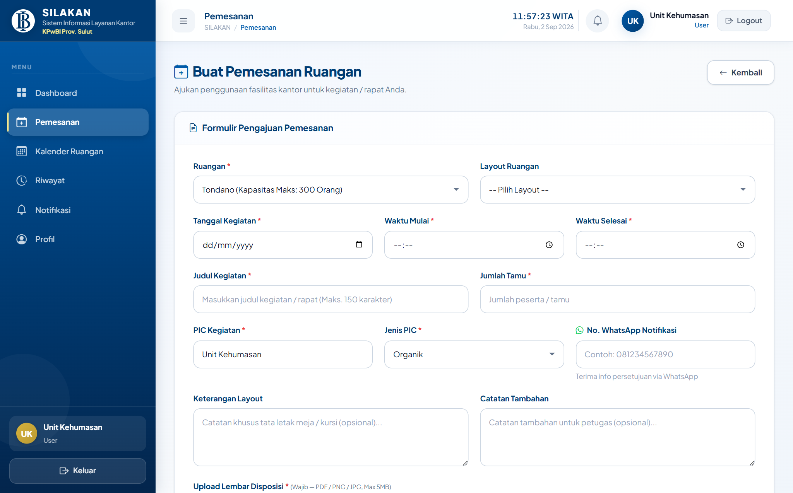 | 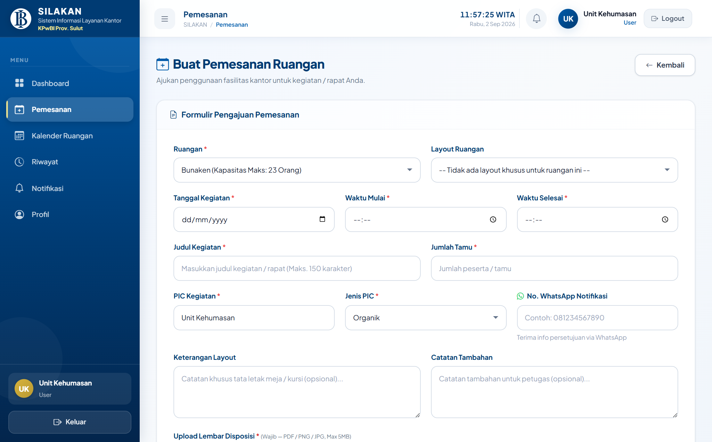 |
| *Gambar 5.3a &mdash; Ruangan Tondano (Mendukung Layout)* | *Gambar 5.3b &mdash; Ruangan Bunaken (Layout Tetap)* |

### **5.4 Validasi Bentrok Jadwal Otomatis (WITA) & Kalender Hari Libur**
- Sistem secara otomatis menghitung bentrok jam rapat (WITA) terhadap pemesanan yang telah disetujui sebelumnya.
- Jika terjadi bentrok, sistem menampilkan kotak peringatan merah dan tombol kirim tidak dapat diproses hingga waktu/ruangan disesuaikan.
- Jika tanggal pelaksanaan bertepatan dengan Hari Libur Nasional, Cuti Bersama, atau Hari Libur Internal BI, sistem menampilkan catatan informasi pemberitahuan.

### **5.5 Pengungahan Lembar Disposisi / Nota Dinas**
- Klik **Pilih Berkas / Browse**.
- Lampirkan lembar disposisi pimpinan dalam format **PDF, JPG, JPEG, atau PNG** (Maksimal **5 MB**).
- Klik tombol **Kirim Pengajuan Pemesanan**.

### **5.6 Memantau Riwayat & Status Pemesanan**
Buka menu **Riwayat** untuk memeriksa daftar permohonan yang diajukan unit Anda beserta status badge indikator:
- 🟡 **PENDING**: Menunggu review dan persetujuan Admin Sarpras.
- 🟢 **DISETUJUI**: Pengajuan disetujui, ruangan terkonfirmasi terkunci.
- 🔴 **DITOLAK**: Pengajuan ditolak oleh Admin (dapat dilihat alasannya).
- ⚪ **CANCEL**: Pemesanan dibatalkan oleh pengguna atau admin.

*Gambar 5.4 &mdash; Halaman Riwayat Pemesanan Unit Kerja & Status Indikator*

### **5.7 Memeriksa Rincian Detail Pemesanan**
Klik ikon **Detail** (<i class="bi bi-eye"></i>) pada tabel riwayat untuk membuka informasi lengkap pemesanan.

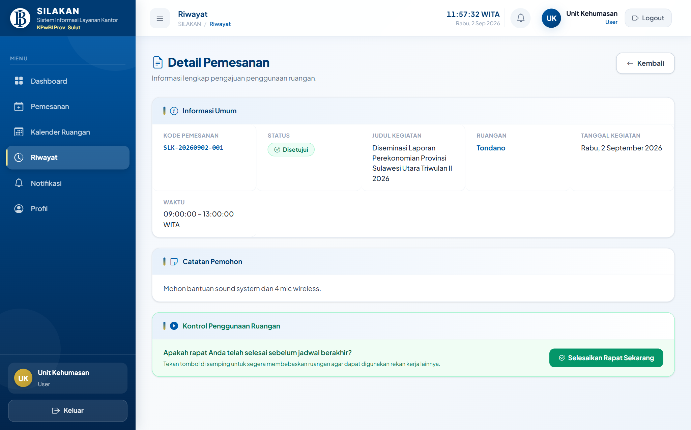
*Gambar 5.5 &mdash; Halaman Rincian Detail Pemesanan Ruangan*

### **5.8 Tata Cara Pembatalan Pemesanan Ruangan**
1. Buka halaman Detail Pemesanan yang bersangkutan.
2. Gulir ke bagian paling bawah dan klik tombol merah **Batalkan Pemesanan**.
3. Konfirmasi kotak dialog yang muncul. Status berubah menjadi *Cancel* dan jadwal ruangan kembali terbuka.

### **5.9 Menggunakan Fitur "Selesai Lebih Awal" (Early Release)**
Jika rapat Anda selesai lebih cepat dari jam rencana, buka halaman Detail Pemesanan dan klik tombol hijau **Selesaikan Rapat Sekarang**. Jam selesai akan langsung diperbarui ke jam saat ini, dan ruangan di TV Lobby seketika berstatus kosong.

### **5.10 Pemanfaatan Kalender Ruangan Interaktif**
Menu **Kalender Ruangan** menyajikan tampilan kalender visual:
- **Biru BI**: Jadwal rapat terkonfirmasi.
- **Merah**: Hari Libur Nasional resmi.
- **Kuning / Amber**: Cuti Bersama pemerintah.
- **Biru Muda**: Hari Libur Internal Bank Indonesia.
- Klik pada agenda rapat untuk membuka modal informasi acara (PIC, nomor WA, jumlah tamu, dll).

*Gambar 5.6 &mdash; Kalender Ruangan Interaktif Terpadu Libur Nasional*

### **5.11 Pengelolaan Notifikasi In-App & Fitur Hapus Pesan**
Klik ikon lonceng pada header atau buka menu **Notifikasi**:
- Klik kartu notifikasi untuk langsung menuju halaman detail pemesanan terkait.
- Klik **Tandai Semua Dibaca** untuk mereset counter notifikasi.
- Klik ikon tempat sampah untuk menghapus notifikasi satuan atau tombol **Hapus Semua** untuk membersihkan seluruh pesan.

*Gambar 5.7 &mdash; Halaman Pengelolaan Notifikasi & Tombol Pembersihan Pesan*

---

## 📌 **BAB VI: PANDUAN ADMINISTRATOR (ADMIN SARPRAS / SEKPR)**

### **6.1 Dashboard Analytics Administrator & Diagram Eksekutif**
Admin disajikan dashboard analitik yang memuat grafik tren pemesanan 6 bulan terakhir, bar chart ruangan terpopuler, distribusi utilisasi per unit kerja, dan daftar antrean permohonan.

*Gambar 6.1 &mdash; Dashboard Analytics Administrator & Visualisasi Diagram*

### **6.2 Alur Verifikasi & Persetujuan (Approval) Pemesanan Ruangan**
1. Buka menu **Pemesanan Ruangan** pada sidebar Admin.
2. Pada tab **Pending**, pilih pengajuan yang masuk lalu klik **Review Approval**.

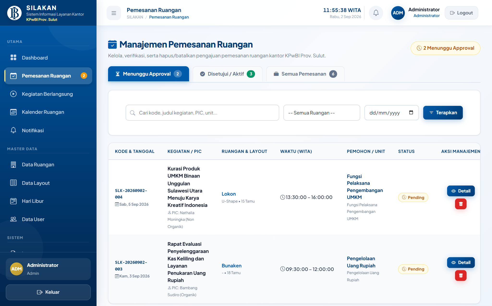
*Gambar 6.2 &mdash; Halaman Daftar Approval Pemesanan dengan Tab Status*

3. Pada halaman review detail, periksa kesesuaian berkas disposisi dan catatan layout.
4. Klik tombol hijau **Setujui Pemesanan**. Sistem secara otomatis mengirimkan pesan konfirmasi WhatsApp resmi kepada nomor PIC kegiatan.

*Gambar 6.3 &mdash; Halaman Review Approval Detail & Tinjauan Berkas Disposisi*

### **6.3 Alur Penolakan (Rejection) Pemesanan Disertai Catatan Alasan**
1. Pada halaman Review Approval, klik tombol merah **Tolak Pemesanan**.
2. Modal pop-up penolakan akan muncul di layar.
3. Ketikkan alasan penolakan secara jelas pada kolom isian (misal: *Ruangan dialihkan untuk kegiatan Pimpinan*).
4. Klik **Kirim Penolakan**. Status pemesanan berubah menjadi *Ditolak* dan alasan terkirim otomatis ke WhatsApp PIC.

*Gambar 6.4 &mdash; Modal Form Input Alasan Penolakan Pemesanan Ruangan*

### **6.4 Pemantauan Live Monitoring & Countdown Timer Real-Time**
Buka menu **Kegiatan Berlangsung** untuk memantau ruangan rapat yang sedang aktif digunakan saat ini. Sistem menyediakan **Live Countdown Timer** yang menghitung mundur sisa durasi rapat secara akurat.

*Gambar 6.5 &mdash; Halaman Live Monitoring Ruangan Aktif & Countdown Timer*

### **6.5 Pengelolaan Master Data Ruangan & Pivot Layout Rounded Badge**
Buka menu **Master Data** &rarr; **Data Ruangan**. Admin dapat menambah ruangan baru, mengedit nama, lokasi lantai, kapasitas hadirin, dan status operasional (*Aktif / Nonaktif / Perawatan*).

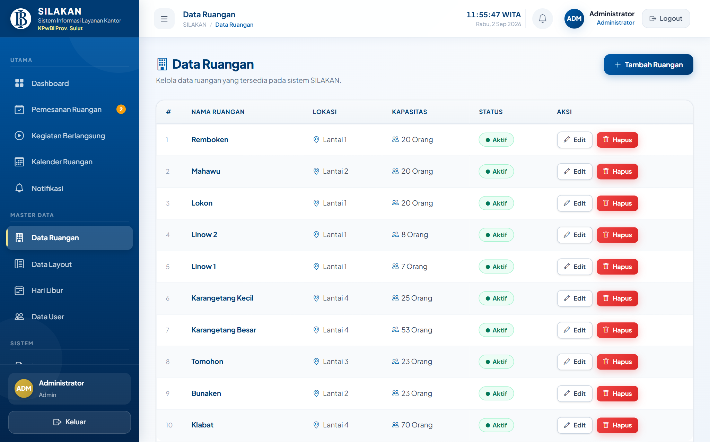
*Gambar 6.6 &mdash; Tabel Master Data Ruangan Rapat KPwBI Prov. Sulut*

Pada form input ruangan, Admin dapat mencentang layout yang diizinkan untuk ruangan tersebut dengan antarmuka rounded badge interaktif:

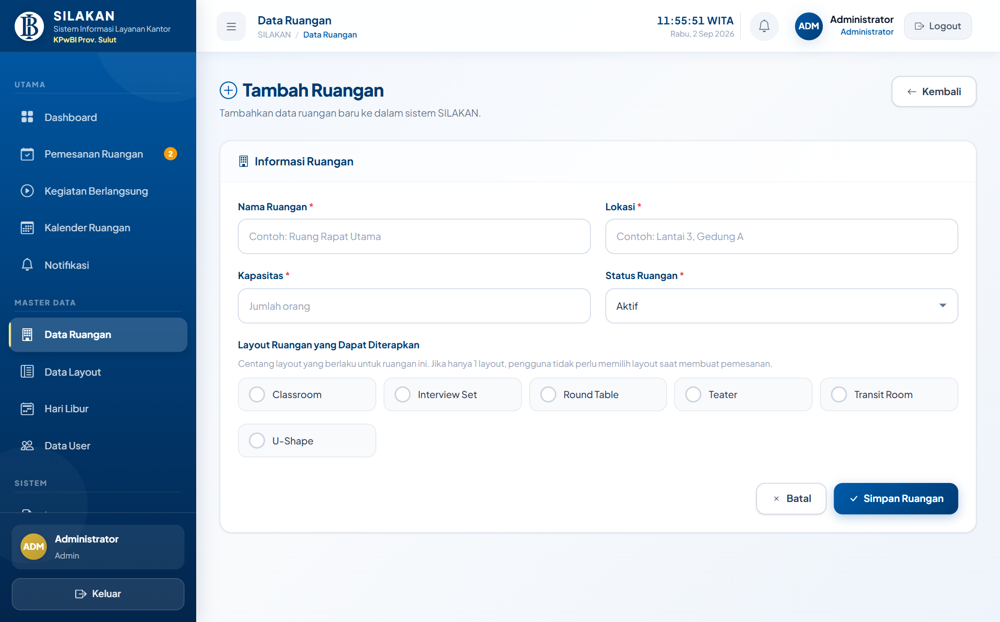
*Gambar 6.7 &mdash; Form Input Ruangan dengan Checkbox Layout Rounded Badge*

### **6.6 Pengelolaan Master Data Layout Ruangan**
Buka menu **Master Data** &rarr; **Data Layout** untuk mengelola jenis tata letak (*U-Shape, Classroom, Teater, Interview Set, Transit Room, Round Table*).

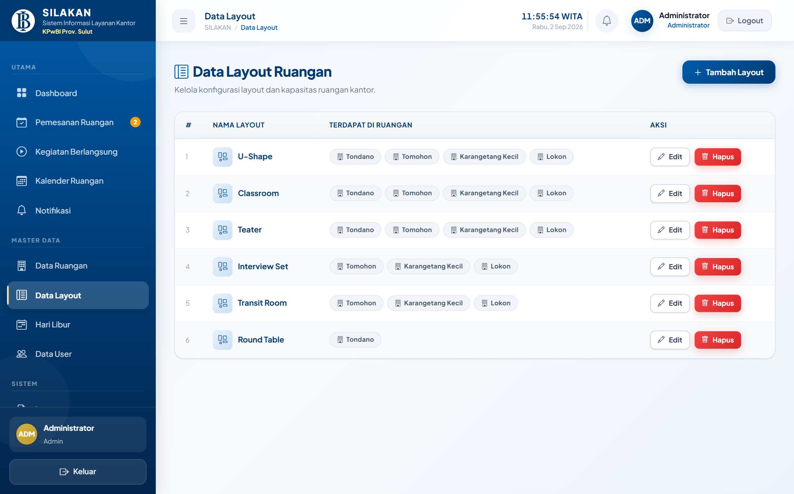
*Gambar 6.8 &mdash; Halaman Master Data Layout Ruangan Rapat*

### **6.7 Pengelolaan Master Hari Libur & Sinkronisasi API Nasional**
Buka menu **Master Data** &rarr; **Hari Libur**:
- Klik tombol **Sync API Libur Nasional** untuk mengunduh seluruh hari libur resmi pemerintah secara otomatis.
- Klik **Tambah Hari Libur** untuk mendaftarkan hari libur internal Bank Indonesia secara manual.

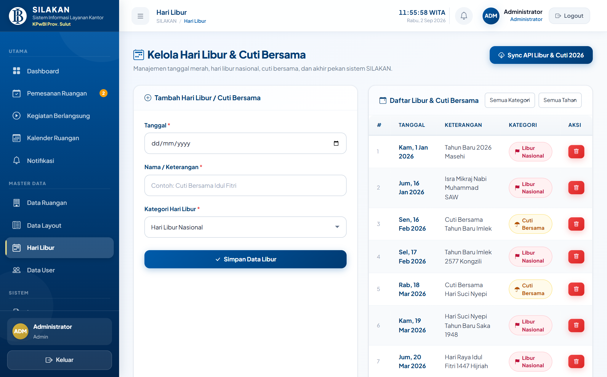
*Gambar 6.9 &mdash; Halaman Master Hari Libur Terintegrasi Tombol Sync API*

### **6.8 Manajemen Akun Pengguna & Proteksi Keamanan Self-Delete**
Buka menu **Master Data** &rarr; **Data User**. Admin dapat menambah akun unit kerja, mengubah role (*Admin / User*), dan mereset password pengguna.
> **Proteksi Keamanan:** Sistem SILAKAN memproteksi admin yang sedang aktif login agar tidak dapat menghapus akunnya sendiri guna menjaga kestabilan sesi.

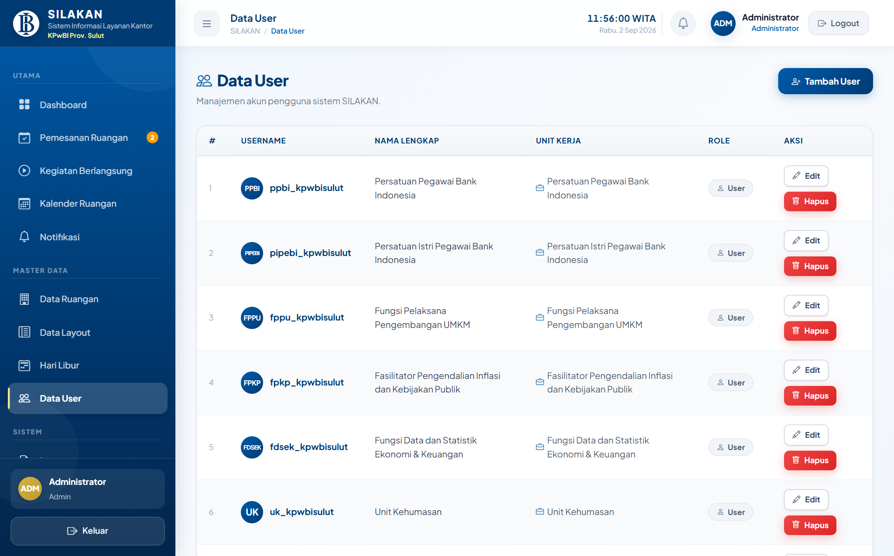
*Gambar 6.10 &mdash; Halaman Manajemen Akun Pengguna & Proteksi Akun Aktif*

### **6.9 Rekapitulasi Laporan, Ekspor Excel & Cetak PDF KOP BI**
Buka menu **Sistem** &rarr; **Laporan**:
1. Tentukan rentang tanggal kegiatan, ruangan, unit kerja, atau status.
2. Klik tombol hijau **Export Excel** untuk mengunduh laporan format `.xlsx`.
3. Klik tombol biru **Cetak Laporan / PDF** untuk membuka pratinjau siap cetak ber-KOP resmi Bank Indonesia.

| Filter Laporan & Rekapitulasi | Pratinjau Dokumen Cetak PDF KOP BI |
| :---: | :---: |
| 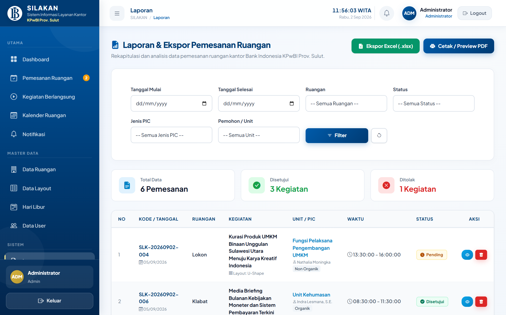 |  |
| *Gambar 6.11 &mdash; Halaman Filter Laporan* | *Gambar 6.12 &mdash; Pratinjau Cetak Laporan PDF Ber-KOP BI* |

### **6.10 Pemantauan Rekam Jejak Terpusat (Audit Log System)**
Buka menu **Sistem** &rarr; **Audit Log** untuk melacak setiap aktivitas pengguna (Aksi, Modul, Alamat IP, Keterangan, dan Timestamp waktu eksekusi).

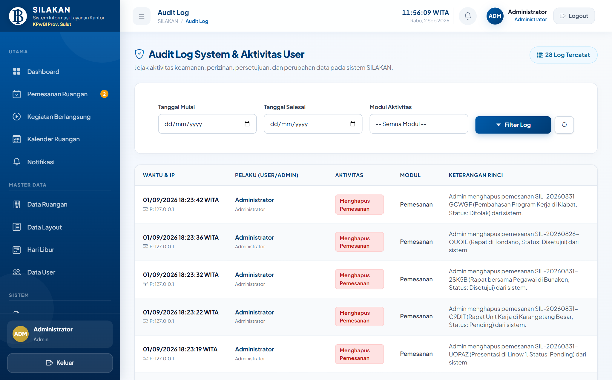
*Gambar 6.13 &mdash; Halaman Audit Log Sistem Pemantau Rekam Jejak Aktivitas*

---

## 📌 **BAB VII: PANDUAN TAMPILAN TV MONITOR LOBBY (KIOSK MODE)**

### **7.1 Mengakses Mode Layar TV Lobby (`/display`)**
1. Buka browser pada Smart TV Lobby Kantor dan akses URL: `http://localhost:8000/display` (atau `/kiosk`).
2. Tekan tombol **F11** pada keyboard untuk mengaktifkan tampilan layar penuh (*Full Screen*).

*Gambar 7.1 &mdash; Tampilan Layar TV Monitor Lobby (Kiosk Mode) Bank Indonesia Sulut*

### **7.2 Pembaruan Otomatis Latar Belakang (Auto Refresh JSON 30 Detik)**
Layar TV Display memperbarui data agenda dan status ruangan secara otomatis setiap 30 detik melalui endpoint JSON `/api/display-data` tanpa terjadi kedipan/reload layar browser.

---

## 📌 **BAB VIII: PANDUAN TROUBLESHOOTING & PENANGANAN KENDALA**

| Kendala / Masalah | Kemungkinan Penyebab | Langkah Solusi Penyelesaian |
| :--- | :--- | :--- |
| **Gagal Login ("Kredensial tidak cocok")** | Salah mengetikkan username/password atau Caps Lock aktif. | Pastikan username sesuai (misal: `uk_kpwbisulut`). Jika lupa password, hubungi Admin Sarpras untuk dilakukan reset password. |
| **Peringatan "Jadwal Bentrok"** | Ruangan telah disetujui untuk kegiatan unit lain pada jam yang bersinggungan. | Buka menu *Kalender Ruangan* untuk melihat jam rapat yang ada. Atur jam sebelum/sesudah jadwal tersebut atau pilih ruangan rapat lain. |
| **Kapasitas Tamu Ditolak** | Jumlah hadirin melebihi daya tampung ruangan. | Sesuaikan jumlah peserta atau pilih ruangan yang berkapasitas lebih besar (contoh: Balai Kerapuan / Tondano untuk &gt; 50 orang). |
| **Layout Tertulis "Tidak Ada Layout Khusus"** | Ruangan memiliki susunan meja-kursi permanen (seperti Bunaken atau Linow). | Kondisi ini normal; lanjutkan pengisian form dan tuliskan kebutuhan tambahan pada kolom catatan user. |
| **File Disposisi Gagal Diunggah** | Ukuran file &gt; 5 MB atau format tidak didukung (.docx, .zip). | Konversikan berkas ke format PDF atau kompres ukuran gambar (JPG/PNG) di bawah 5 Megabyte. |
| **Notifikasi WhatsApp Tidak Terkirim** | Nomor tidak aktif WA, salah awalan, atau kuota token gateway habis. | Pastikan nomor berawalan `08...` atau `628...` dan laporkan ke teknisi IT untuk pemeriksaan server gateway. |
| **Admin Tidak Bisa Menghapus Akun** | Akun yang ingin dihapus adalah akun admin yang sedang login saat ini. | Sistem memproteksi akun aktif. Gunakan akun admin lain jika ingin menghapus akun tersebut. |

---

## 📌 **BAB IX: FREQUENTLY ASKED QUESTIONS (FAQ)**

- **Q: Kapan batas waktu pengajuan pemesanan ruangan rapat?**  
  *A: Disarankan mengajukan selambat-lambatnya 1 (satu) hari kerja sebelum acara agar pengelola sarpras dapat menyiapkan kebersihan dan tata letak ruangan dengan optimal.*
- **Q: Apakah pengajuan yang sudah disetujui bisa diedit jadwalnya?**  
  *A: Pengajuan yang telah disetujui tidak dapat diedit langsung demi mencegah konflik jadwal. Batalkan pemesanan tersebut lalu ajukan permohonan baru dengan jam yang diinginkan.*
- **Q: Siapa yang dapat melihat lembar disposisi yang diunggah?**  
  *A: Berkas disposisi hanya dapat diakses oleh unit pemohon dan Administrator Sarpras yang memverifikasi pengajuan.*
- **Q: Apa yang harus dilakukan jika rapat selesai lebih cepat?**  
  *A: Buka menu Riwayat &rarr; Detail Pemesanan, lalu klik tombol "Selesaikan Rapat Sekarang" agar ruangan seketika berstatus kosong di layar TV lobby.*

---

## 📌 **BAB X: GLOSARIUM & PENUTUP**

### **Glosarium Istilah Sistem**
- **SILAKAN**: Sistem Informasi Layanan Kantor KPwBI Prov. Sulut.
- **WITA**: Waktu Indonesia Tengah (UTC+8) &mdash; standar zona waktu operasional sistem di Kota Manado.
- **Smart Layout Filtering**: Penyaringan cerdas yang membatasi opsi layout hanya sesuai kemampuan fisik ruangan.
- **Early Release**: Mekanisme penyelesaian rapat lebih awal untuk membebaskan ruangan secara instan.
- **Kiosk Mode**: Mode layar TV lobby publik tanpa login dengan pembaruan otomatis latar belakang.
- **Audit Log**: Rekam jejak digital keamanan yang mencatat seluruh aktivitas pengguna dan administrator.

### **Pusat Layanan Bantuan (Helpdesk Sarpras)**
Jika mengalami kendala teknis atau membutuhkan bantuan sarana rapat:
- **Unit Pengelola**: Unit Rumah Tangga & Logistik / Sekpr KPwBI Prov. Sulut
- **Lokasi**: Gedung Kantor Perwakilan Bank Indonesia Prov. Sulut, Lantai 2, Manado
- **Email**: `sarpras_kpwbisulut@bi.go.id` | **Ext. Telepon Internal**: 8200 / 8201
