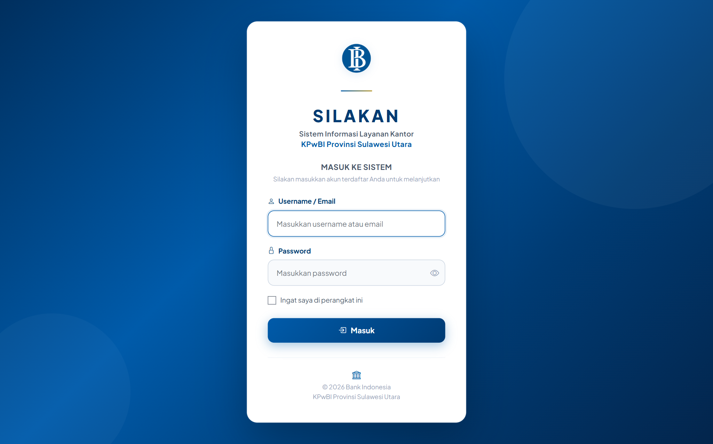
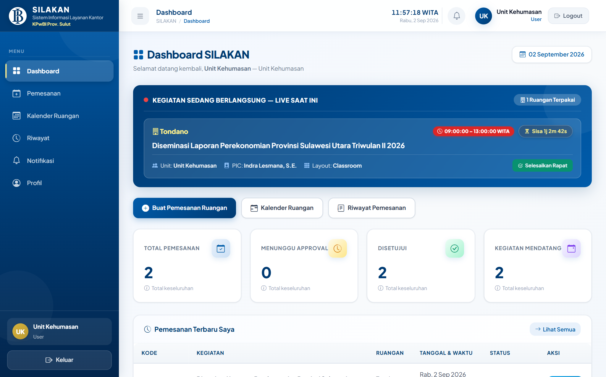
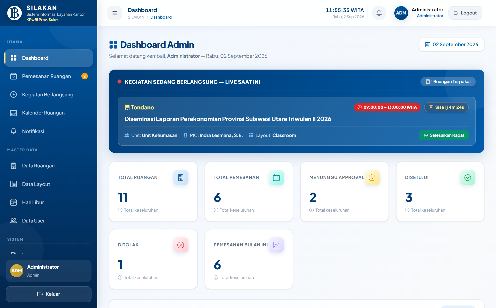
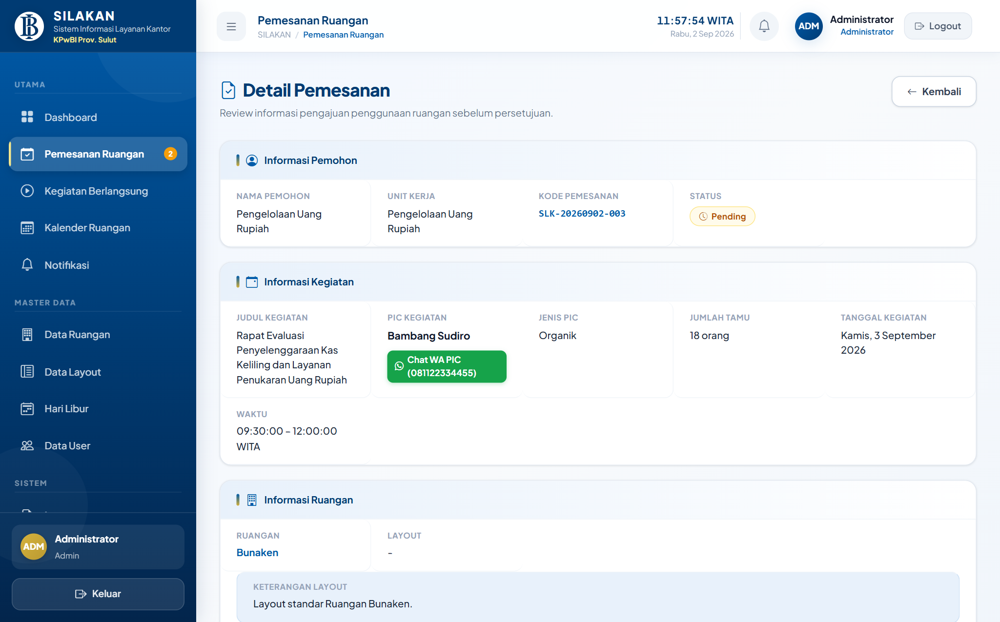
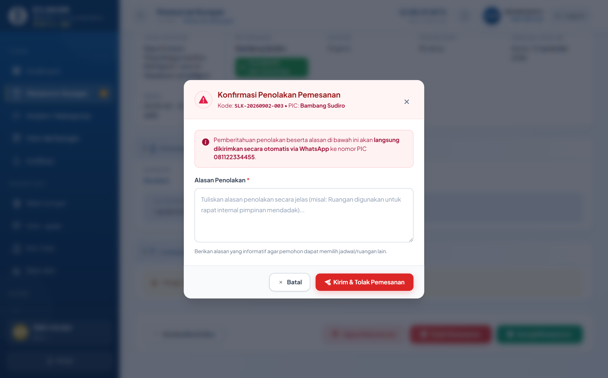
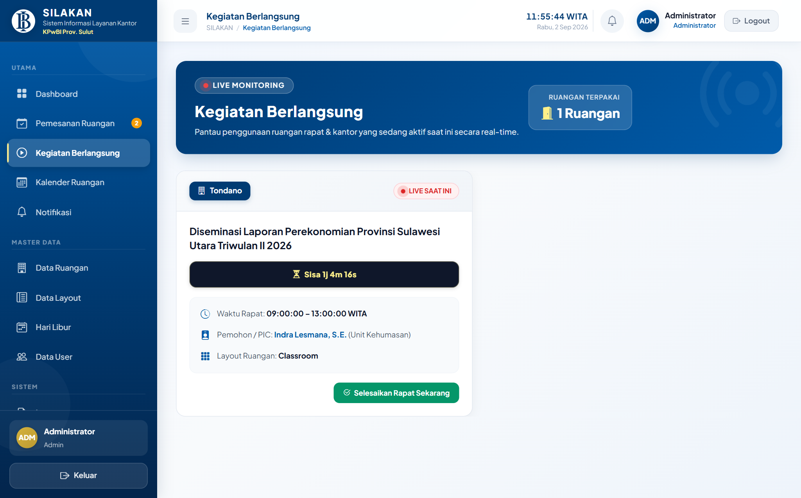
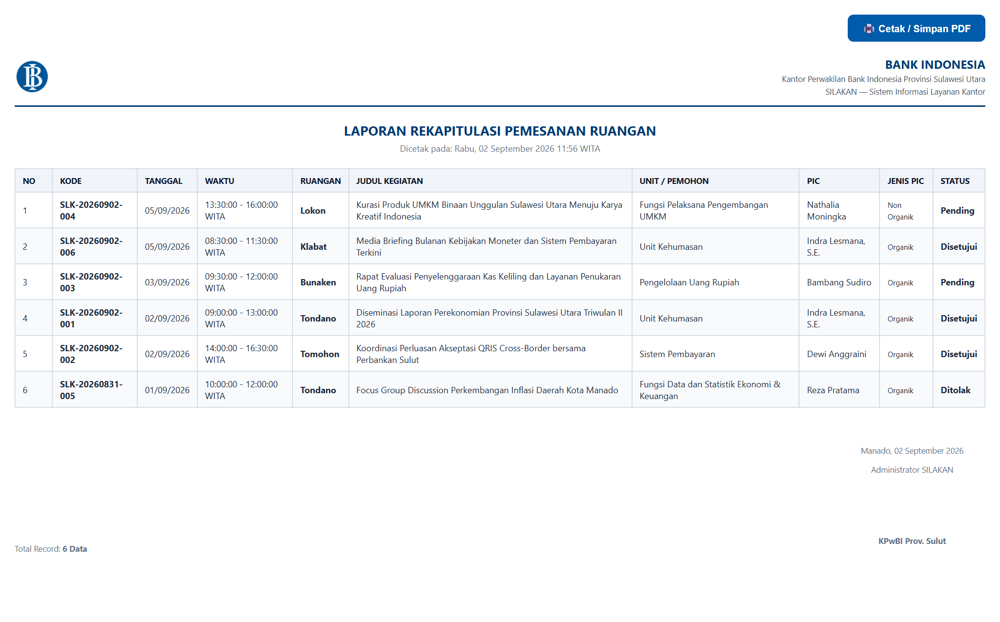
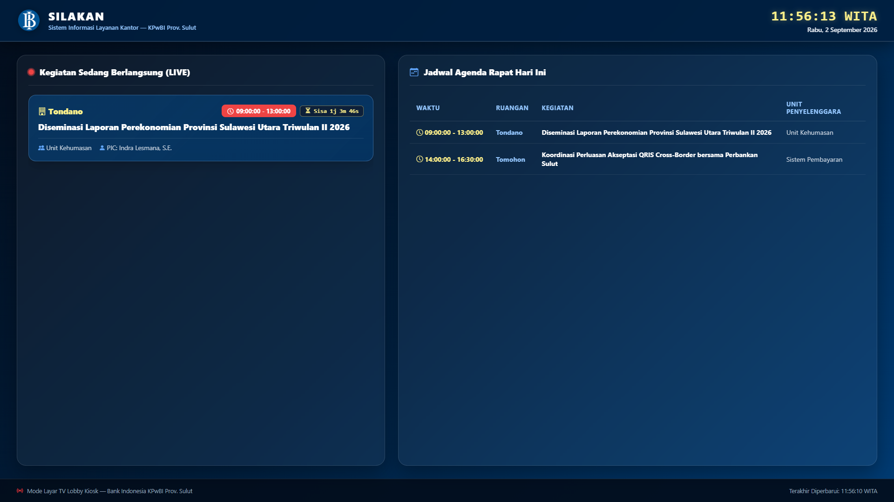

# 📖 BUKU PANDUAN RINGKAS SISTEM (QUICK START GUIDE)
## **SILAKAN — Sistem Informasi Layanan Kantor**
### **Kantor Perwakilan Bank Indonesia Provinsi Sulawesi Utara**

---

**Format Dokumen** : Buku Panduan Ringkas Operasional Cepat &mdash; SILAKAN  
**Versi Dokumen** : 1.0 (Ringkas Siap Cetak)  
**Tanggal Rilis** : September 2026  
**Instansi** : Kantor Perwakilan Bank Indonesia Provinsi Sulawesi Utara  
**Format Cetak Tersedia** :
- 📝 **Microsoft Word (.doc)**: [Panduan_Ringkas_SILAKAN_v1.0.doc](file:///d:/Bank%20Indo/silakan/Panduan_Ringkas_SILAKAN_v1.0.doc) (6.25 MB, MHTML Gambar Tertanam)
- 📄 **PDF Siap Cetak (A4)**: [Panduan_Ringkas_SILAKAN.pdf](file:///d:/Bank%20Indo/silakan/Panduan_Ringkas_SILAKAN.pdf) (4.16 MB, Layout Resmi BI)
- 🌐 **Pratinjau Cetak Browser**: [panduan_ringkas.html](file:///d:/Bank%20Indo/silakan/panduan_ringkas.html)

---

## 💡 SEKILAS TENTANG SILAKAN

**SILAKAN (Sistem Informasi Layanan Kantor)** adalah aplikasi website internal milik **Bank Indonesia KPwBI Prov. Sulut** yang digunakan untuk **memesan dan mengelola ruangan rapat kantor secara online**.

### 4 Manfaat Utama SILAKAN:
1. **Bebas Bentrok**: Sistem otomatis menolak jika ada yang memesan ruangan dan jam yang sama.
2. **Jadwal Terbuka**: Ketersediaan ruangan langsung terlihat pada kalender visual interaktif.
3. **Pemberitahuan Otomatis via WhatsApp**: Pemohon langsung menerima status persetujuan di WhatsApp.
4. **Layar TV Lobby Otomatis**: Agenda rapat aktif hari ini langsung tampil di TV Monitor Lobby kantor secara waktu-nyata (*real-time*).

---

## ⚡ 3 LANGKAH CEPAT MENJALANKAN SISTEM (UNTUK OPERATOR / IT)

1. **Nyalakan Database (MySQL XAMPP)**:
   - Buka aplikasi **XAMPP Control Panel**.
   - Klik tombol **Start** pada baris **MySQL** (lampu harus hijau).
2. **Nyalakan Server Aplikasi (Laravel)**:
   - Buka Command Prompt di folder project: `d:\Bank Indo\silakan`.
   - Ketik: `php artisan serve` &rarr; Server aktif di `http://127.0.0.1:8000`.
3. **Buka di Browser (Google Chrome / Edge)**:
   - **Halaman Login Sistem**: `http://localhost:8000`
   - **Layar TV Monitor Lobby**: `http://localhost:8000/display`

### 🔑 Akun Siap Pakai untuk Uji Coba:
| Role Pengguna | Username | Password | Keterangan Fungsi |
| :--- | :--- | :--- | :--- |
| **Administrator** | `admin` | `password` | Pengelola Sarpras / Sekpr (Approval & Master) |
| **User (Humas)** | `uk_kpwbisulut` | `kpwbisulut` | Unit Kehumasan (Pemohon Ruangan) |
| **User (Sistem Pembayaran)** | `sp_kpwbisulut` | `kpwbisulut` | Unit Sistem Pembayaran |
| **User (Uang Rupiah)** | `pur_kpwbisulut` | `kpwbisulut` | Unit Pengelolaan Uang Rupiah |
| **Seluruh Unit Kerja Lainnya** | *(username unit)* | `kpwbisulut` | Default password seluruh akun user |

---

## 👤 BAGIAN 1: PANDUAN PENGGUNA (USER / PEGAWAI UNIT KERJA)

### 1. Masuk ke Sistem (Login) & Dashboard User
1. Buka browser dan akses: `http://localhost:8000`.
2. Masukkan **Username** unit kerja Anda (contoh: `uk_kpwbisulut`) dan **Password**: `kpwbisulut`.
3. Klik tombol biru **Masuk**.

*Gambar 1.1 &mdash; Halaman Login Masuk Sistem SILAKAN*

Setelah login berhasil, Anda langsung disajikan **Dashboard Pengguna** yang memuat kartu metrik pemesanan unit, daftar rapat yang sedang aktif hari ini, dan permohonan terkini.

*Gambar 1.2 &mdash; Dashboard Pengguna Unit Kerja*

---

### 2. Memeriksa Ketersediaan Ruangan di Kalender Interaktif
Sebelum memesan, buka menu **Kalender Ruangan** di sidebar kiri untuk memeriksa apakah ruangan yang Anda inginkan sudah terisi:
- 🟦 **Biru**: Rapat internal yang sudah disetujui.
- 🟥 **Merah**: Hari Libur Nasional.
- 🟨 **Kuning**: Cuti Bersama.
- 🔷 **Biru Muda**: Hari Libur Khusus Bank Indonesia.
- *Klik pada balok rapat di kalender untuk melihat rincian acara, PIC, dan jam pelaksanaannya.*

*Gambar 1.3 &mdash; Kalender Ruangan Interaktif Terintegrasi Libur Nasional*

---

### 3. Cara Memesan Ruangan Rapat (Langkah Demi Langkah)
1. Klik tombol **+ Buat Pemesanan Baru** pada Dashboard (atau klik menu **Pemesanan**).
2. Lengkapi isian formulir:
   - **Ruangan Rapat**: Pilih salah satu dari 11 ruangan rapat di KPwBI Sulut (*Tondano, Bunaken, Tomohon, Klabat, Lokon, dll*).
   - **Layout Ruangan**: Pilih susunan meja (*U-Shape, Classroom, Teater, Round Table*). Untuk ruangan dengan meja permanen (seperti Bunaken), sistem otomatis menampilkan opsi tetap.
   - **Tanggal Kegiatan**: Tentukan tanggal acara.
   - **Waktu Mulai & Selesai**: Masukkan jam rapat dalam zona **WITA** (contoh: `09:00` s/d `11:30`).
   - **Judul Kegiatan**: Tuliskan nama agenda acara.
   - **PIC Kegiatan & Jenis PIC**: Nama penanggung jawab dan kategori (*Organik / Non Organik*).
   - **Nomor WhatsApp PIC**: Nomor WA aktif (contoh: `081234567890`) agar konfirmasi otomatis terkirim ke ponsel Anda.
   - **Jumlah Tamu**: Masukkan estimasi hadirin (tidak boleh melampaui kapasitas ruangan).
   - **Unggah Disposisi (Opsional)**: Lampirkan berkas nota dinas / memo pimpinan (PDF/JPG/PNG maks 5 MB).
3. Klik tombol biru **Kirim Pengajuan Pemesanan**.

*Gambar 1.4 &mdash; Formulir Pengajuan Pemesanan Ruangan Baru*

---

### 4. Memantau Status Permohonan & Detail Pemesanan
Buka menu **Riwayat** di sebelah kiri untuk melihat perkembangan pengajuan:
- 🟡 **PENDING**: Sedang dalam antrean review Administrator Sarpras.
- 🟢 **DISETUJUI**: Pengajuan disetujui! Ruangan resmi terkunci untuk unit Anda dan tayang di TV Lobby.
- 🔴 **DITOLAK**: Pengajuan ditolak oleh Admin (klik tombol **Detail** untuk membaca alasan penolakannya).
- ⚪ **CANCEL**: Pemesanan dibatalkan.

*Gambar 1.5 &mdash; Riwayat Pemesanan Unit Kerja & Label Indikator Status*

---

### 5. Pembatalan & Fitur "Selesai Lebih Awal" (Early Release)
- **Batalkan Rapat**: Jika kegiatan batal, buka halaman **Detail Pemesanan**, gulir ke bawah dan klik tombol merah **Batalkan Pemesanan**. Ruangan langsung bebas kembali.
- **Selesai Lebih Cepat**: Jika rapat Anda selesai lebih awal dari jadwal (misal jadwal s/d 12.00 WITA, namun 10.30 sudah bubar), buka halaman **Detail Pemesanan** dan klik tombol hijau **Selesaikan Rapat Sekarang**. Jam selesai langsung disesuaikan ke waktu saat ini dan status ruangan di TV Lobby seketika menjadi **Tersedia (Kosong)**.

---

## 🛠️ BAGIAN 2: PANDUAN ADMINISTRATOR (ADMIN SARPRAS / SEKPR)

### 1. Dashboard Admin & Statistik Eksekutif
Login dengan Username: `admin` dan Password: `password`. Dashboard menampilkan ringkasan metrik ruangan, grafik tren 6 bulan, diagram ruangan terpopuler, dan daftar pengajuan yang butuh tindakan cepat.

*Gambar 2.1 &mdash; Dashboard Analytics Administrator Sarpras*

---

### 2. Cara Menyetujui (Approve) & Menolak (Reject) Pemesanan
1. Buka menu **Pemesanan Ruangan** pada sidebar Admin.
2. Pada tab **Pending**, klik tombol **Review Approval** pada permohonan yang masuk.

| Review Approval & Berkas | Modal Penolakan Berargumen |
| :---: | :---: |
|  |  |
| *Gambar 2.2 &mdash; Review Berkas Disposisi & Tombol Setujui* | *Gambar 2.3 &mdash; Modal Input Alasan Penolakan* |

3. **Untuk Menyetujui**: Periksa berkas disposisi terlampir, lalu klik tombol hijau **Setujui Pemesanan**.  
   *Sistem otomatis mengunci jadwal di kalender, menampilkan agenda di TV Lobby, dan mengirimkan pesan WhatsApp konfirmasi ke nomor PIC pemohon.*
4. **Untuk Menolak**: Klik tombol merah **Tolak Pemesanan**, ketikkan alasan penolakan secara jelas pada kotak pop-up (contoh: *"Ruangan dialihkan untuk Kunjungan Dewan Gubernur"*), lalu klik **Kirim Penolakan**. Alasan tersebut langsung terkirim via WhatsApp kepada pemohon.

---

### 3. Pemantauan Rapat Aktif (Live Monitoring) & Countdown Timer
Buka menu **Kegiatan Berlangsung** untuk memantau seluruh ruangan yang sedang aktif digunakan saat ini. Dilengkapi dengan **Live Countdown Timer** yang menghitung mundur sisa waktu rapat secara real-time tanpa perlu refresh browser.

*Gambar 2.4 &mdash; Live Monitoring Ruangan Aktif & Countdown Timer Real-Time*

---

### 4. Mengatur Master Data & Sinkronisasi Hari Libur
- **Master Ruangan**: Buka menu **Data Ruangan** untuk menambah ruangan baru, mengubah daya tampung (kapasitas orang), serta mencentang pilihan layout apa saja yang diizinkan untuk ruangan tersebut.
- **Master Hari Libur**: Buka menu **Hari Libur**, lalu klik tombol biru **Sync API Libur Nasional**. Sistem otomatis mengunduh tanggal merah resmi pemerintah tahun berjalan.
- **Data User**: Buka menu **Data User** untuk menambah akun unit baru atau mereset password staf yang lupa kata sandi.

---

### 5. Rekapitulasi Laporan, Ekspor Excel & Cetak PDF KOP BI
Buka menu **Sistem** &rarr; **Laporan**. Saring data berdasarkan tanggal, ruangan, atau status acara:
- Klik tombol hijau **Export Excel** untuk mengunduh spreadsheet `.xlsx`.
- Klik tombol biru **Cetak Laporan / PDF** untuk mencetak dokumen ber-KOP resmi Bank Indonesia.

*Gambar 2.5 &mdash; Pratinjau Dokumen Cetak Laporan PDF Ber-KOP Resmi Bank Indonesia*

---

## 📺 BAGIAN 3: TAMPILAN TV MONITOR LOBBY (KIOSK MODE)

Untuk menayangkan jadwal rapat pada Smart TV di lobby kantor:
1. Buka browser pada TV atau Mini PC Lobby, lalu buka alamat:  
   👉 **`http://localhost:8000/display`** (atau `/kiosk`).
2. Tekan tombol **F11** pada keyboard agar tampilan menjadi layar penuh (*Full Screen*).
3. **Fitur Layar TV Ini**:
   - Tampilan tema gelap (*Dark Mode*) elegan ber-KOP resmi Bank Indonesia.
   - Jam digital WITA waktu nyata.
   - **Otomatis memperbarui data setiap 30 detik tanpa kedip/reload layar**. Ruangan yang terisi berwarna merah, dan ruangan kosong berwarna hijau.

*Gambar 3.1 &mdash; Layar TV Monitor Lobby (Kiosk Mode) Bank Indonesia Sulut*

---

## ❓ PANDUAN SOLUSI CEPAT (TROUBLESHOOTING RINGKAS)

| Masalah yang Terjadi | Penyebab & Cara Mengatasinya |
| :--- | :--- |
| **Muncul tulisan "Jadwal Bentrok"** | Ruangan tersebut sudah disetujui untuk rapat unit lain di jam yang sama. Silakan ganti jam pelaksanaan atau pilih ruangan lain. |
| **Jumlah tamu ditolak sistem** | Peserta melebihi kapasitas ruangan. Kurangi jumlah peserta atau pilih ruangan yang lebih besar (contoh: Balai Kerapuan / Tondano). |
| **Layout tertulis "Tidak Ada Layout Khusus"** | Ini normal untuk ruangan yang susunan meja-kursinya permanen (seperti Bunaken). Lanjutkan pengisian formulir seperti biasa. |
| **File disposisi gagal diunggah** | Ukuran file melebihi 5 MB. Ubah dokumen ke format PDF atau kecilkan ukuran gambar di bawah 5 MB sebelum diunggah. |
| **Lupa kata sandi akun unit kerja** | Hubungi Administrator Sarpras untuk melakukan reset kata sandi melalui menu Data User. |

---

### 📞 Pusat Bantuan & Layanan Sarpras:
- **Unit Pengelola**: Unit Rumah Tangga & Logistik / Sekpr KPwBI Prov. Sulut
- **Lokasi**: Gedung Kantor Perwakilan Bank Indonesia Prov. Sulut, Lantai 2, Manado
- **Email**: `sarpras_kpwbisulut@bi.go.id` | **Ext. Telepon Internal**: 8200 / 8201
